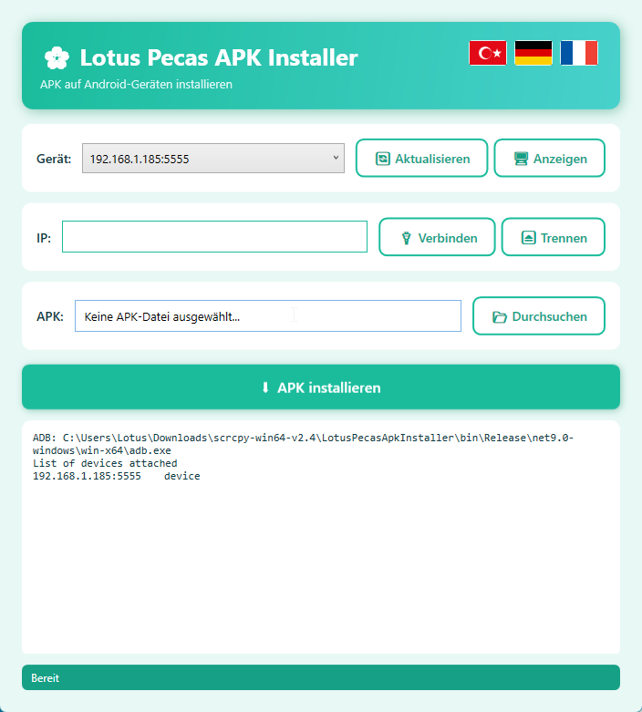

# Lotus Pecas APK Installer

WPF .NET 9 uygulaması — Android cihazlara USB veya IP üzerinden bağlanıp APK yükler.



## Özellikler

- 🔌 USB cihazları otomatik algılama
- 🌐 IP üzerinden kablosuz bağlantı (`adb connect`)
- 📦 APK seçip tek tıkla yükleme (`adb install -r`)
- 🌍 Çoklu dil desteği: Türkçe / Deutsch / Français (bayrak seçici)
- 🎨 Turkuaz temalı modern arayüz, özel popup mesajları
- 📁 Boşluklu yollar güvenli (ArgumentList)
- 📦 Self-contained — .NET 9 runtime gömülü, `adb.exe` dahil

## Kullanım

1. Release zip'ini indir, klasöre çıkar
2. `LotusPecasApkInstaller.exe` çalıştır
3. Cihaz USB ile bağla veya IP gir → Bağlan
4. APK seç → APK Yükle

## Derleme

```bash
dotnet publish -c Release
```

Çıktı: `bin/Release/net9.0-windows/win-x64/publish/`

## Version

v1.0.1

## Lisans

[MIT License](LICENSE) — özgürce kullanabilir, değiştirebilir ve dağıtabilirsiniz. Maddi bir beklenti yoktur.

Paket içinde dağıtılan `adb.exe` (Apache 2.0, © Google) ve `scrcpy.exe` (Apache 2.0, © Genymobile) üçüncü taraf araçlardır; kendi lisansları geçerlidir.
